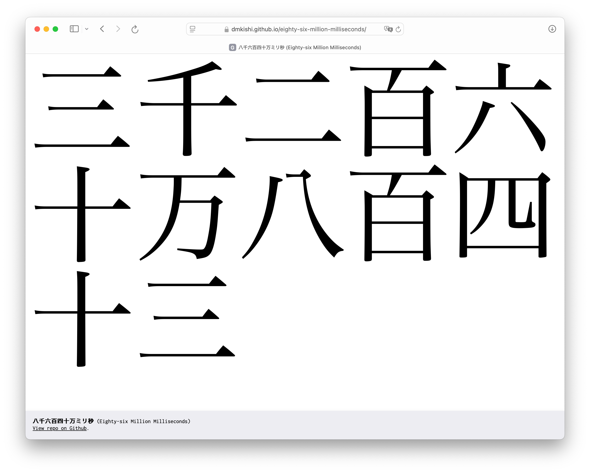

八千六百四十万ミリ秒 (Eighty-six Million Milliseconds)
================================================================================

A Web-based millisecond clock expressed in Japanese numerals. The clock synchronizes with the display refresh rate, typically 60 or 120 Hz.

View at <https://dmkishi.github.io/eighty-six-million-milliseconds/>.
